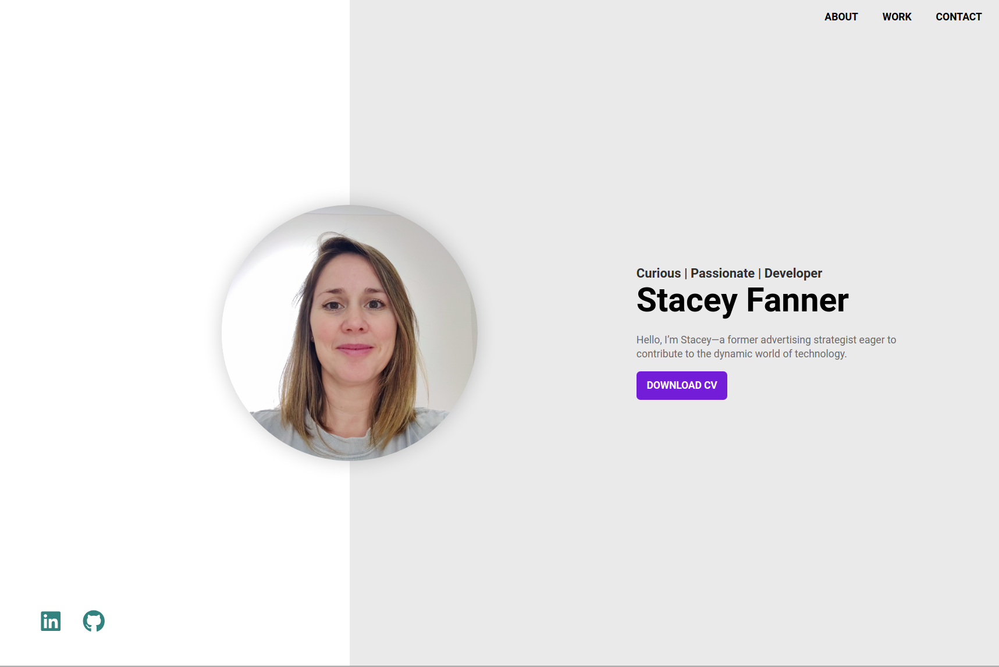

# Welcome to my portfolio!

This web-based application serves as a showcase for the exciting projects I am currently working on.

  

  
To see the deployed site: https://www.staceyfanner.com

## About the Web App

With deepened React skills, I revamped my vanilla JS portfolio with React. It was great to be able to introduce

## Planning

### User stories

- I want to be welcomed by a intro splash page which includes a name and title
- I want to learn more about stacey fanner
- I want to see her relevant tech skills
- I want to explore her key projects
- I want to be able to make contact via a range of methods

### Planning artifacts

1. [Figma wireframe](<https://www.figma.com/file/5TgUXIooWHFEpJBoSCQFDr/Portfolio---Web-%26-Mobile-(nology)?type=design&node-id=0%3A1&mode=design&t=woVCtkQQ5AKWk7Y6-1>)

 
 

2. [Kanban project board](https://github.com/users/staceyjf/projects/6/views/2)

 
 

## Key learning highlights

1. Exploring CSS grid
2. Utilized Sass and BEM naming conventions to structure my CSS
3. Integrated Polypane into my process to streamline the design across media queries

## Challenges

1. Designing responsively - balancing landscape and portrait formats to have a good design across different devices.

## Screengrabs

Contact page across differing screen sizes

 

## Technologies Used

